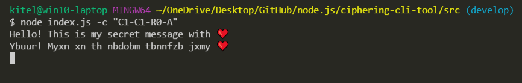

# Ciphering CLI tool

### CLI tool that encodes and decode a text by 3 substitution ciphers



This tool uses the next ciphers:

1. Ceasar (shift 1)
1. Atbash
1. ROT-8

To launch ciphering CLI tool you need:

1. fork this repository
1. clone it to your PC
1. using terminal start index.js with node

#### Docs:

    Usage: node index.js [options]

    Options:

    -c, --config    mandatory option for passing ciphers configuration
    -i, --input     path to input file (optional)
    -o, --output    path to output file (optional)

There is only one mandatory option, which you need to pass in CLI. It is **"-c** or **"--config"**.
Without this option, you will receive an error.

Acceptable configs for ciphers:

1. Ceasar encode "C1"
1. Ceasar decode "C0"
1. Atbash encode and decode "A"
1. ROT-8 encode "R1"
1. ROT-8 decode "R0"

All cipher configs should be split by dash "-".

#### Cipher Config Examples

"R1-R0-A-R0-C1"
"C1-C0-A-R1-R0-A-R0-R0-C1-A"

### Other options

If you pass **"-i"** or **"--input"** option and file name with a message for encoding, the tool will read this file to get input information. Otherwise, the tool will ask you to enter a message for encoding from the standard input.

If you pass **"-o"** or **"--output"** option and file name, the tool will append encoded information into the specified file. Otherwise, the tool will print your encoded message to the standard output.

**Usage example:**

```bash
$ node index.js -c "C1-C1-R0-A" -i "./input.txt" -o "./output.txt"
```

```bash
$ node index.js -c "C1-C0-A-R1-R0-A-R0-R0-C1-A" -i "./input.txt" -o "./output.txt"
```

```bash
$ node index.js -c "A-A-A-R1-R0-R0-R0-C1-C1-A"
```

```bash
$ node index.js -c "C1" -i "./input.txt"
```
